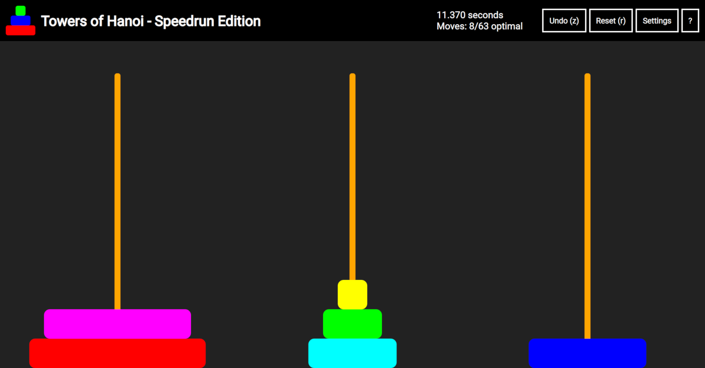

# Towers of Hanoi - Speedrun Edition

A highly customizable online version of Towers of Hanoi, where the controls are optimized for speed.
Featuring a precise timer, high score tracker, and blindfold mode.

Play here: https://towers.doteye.online  
See it in action: https://youtu.be/3em6gaMaQ54  
Discord server: https://discord.gg/tykwEuuYCt

## Optimizations

Most digital Towers of Hanoi games require you to drag and drop disks with either a mouse or a touchscreen.
These controls are intuitive, but slow.
This often leads to the player thinking of the moves faster than they can perform them.

To overcome this bottleneck, Towers of Hanoi - Speedrun Edition uses keyboard controls that can be performed at incredibly fast speeds.

There are two ways to control the game:

### Fast (2 keystrokes per move / easy to learn)

Use the number keys to pickup/place disks at the corresponding stack number.
For example, to pick up a disk from the first stack and place it on the third stack, press `1` and then `3`.

### Super Fast (1 keystroke per move / hard to learn)

Press the following keys to instantly perform the move.
The mapping can be changed in the settings.

- `s` - move from stack `2` to stack `1`
- `d` - move from stack `1` to stack `2`
- `f` - move from stack `1` to stack `3`
- `j` - move from stack `3` to stack `1`
- `k` - move from stack `3` to stack `2`
- `l` - move from stack `2` to stack `3`
